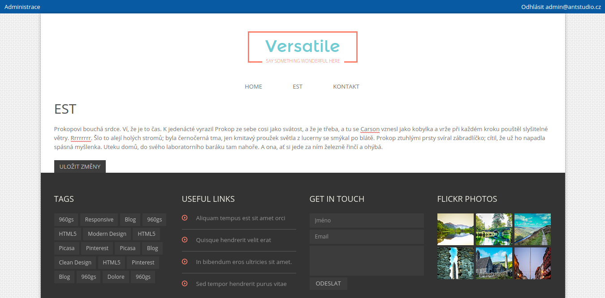
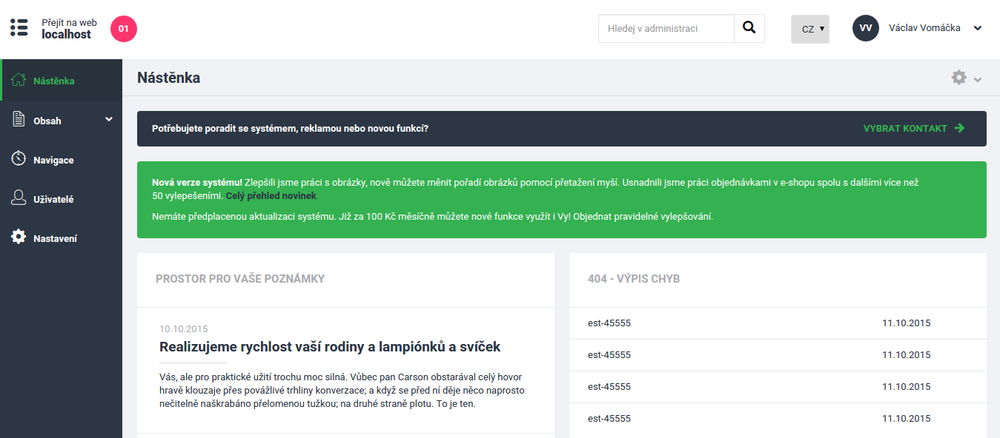

**Minimum requirements**: PHP 5.5+, MySQL 5.6+

Installation
============

- First install GIT (http://git-scm.com/)
- `git clone https://github.com/mrtnzlml/CMS-lite.git`
- Then install Composer (http://getcomposer.org/)
- `composer install` (fetches PHP dependencies)
- Create empty database (MySQL)
- Rename `config.local.neon.dist` (in app/config) to `config.local.neon` and setup database credentials
- `php index.php orm:schema-tool:create` (generates database structure)
- `php index.php cms:fixtures:load` (loads basic data, after that CMS should work)
- Install Bower (http://bower.io/, NPM: https://www.npmjs.com/)
- `bower install` (fetches JS dependencies)
- Install Grunt (http://gruntjs.com/)
- `grunt` (prepares JS, CSS, fonts, ...), you maybe want to `npm install` before if you don't have Grunt installed yet

You should run every command form website root directory. Only commands which contains `index.php` should be executed from `www` folder.

Another useful commands:
- `php index.php` (displays all available commands)
- `php index.php cms:cms:fixtures:load --demo` (loads demo data)
- `php index.php orm:schema-tool:update --force` (updates database schema)

Dependencies
============
- grunt + grunt-contrib packages (concat, copy, cssmin, less, uglify)
- bootstrap, nette.ajax.js, nette-forms, jquery, selectize
- nette (application, caching, DI, finder, forms, robot-loader, security, utils)
- latte, tracy, texy, webloader, minify, faker, secured-links
- kdyby (doctrine, annotations, console, events, translation, autowired, monolog)
- doctrine (data-fixtures, migrations, ORM)
- testbench, nette\tester

Frontend preview
================
Simple creation of new themes:

Administration preview
======================
Fully customizable administration:

